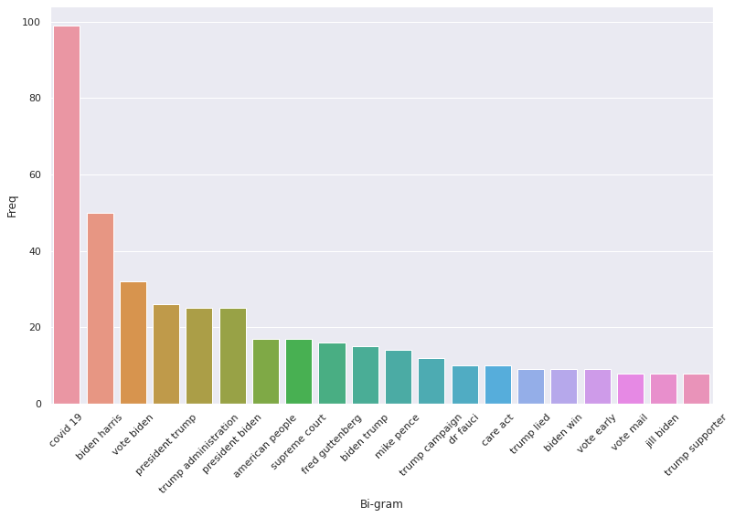
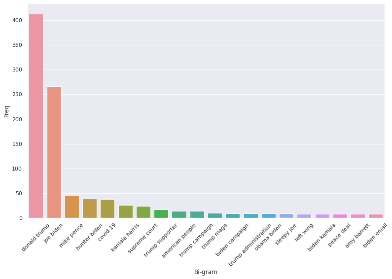
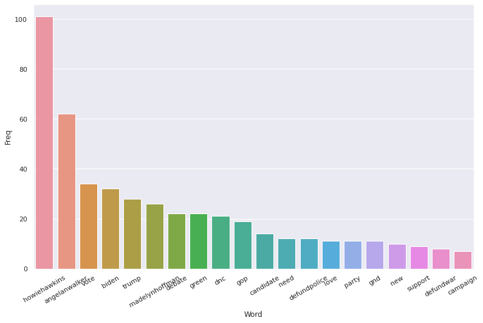
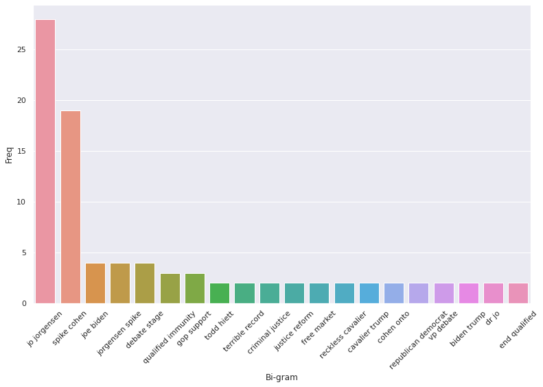
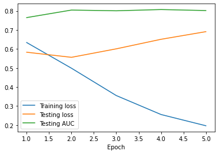
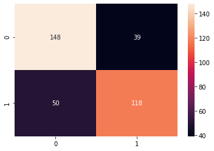
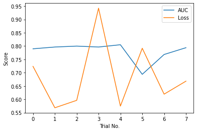
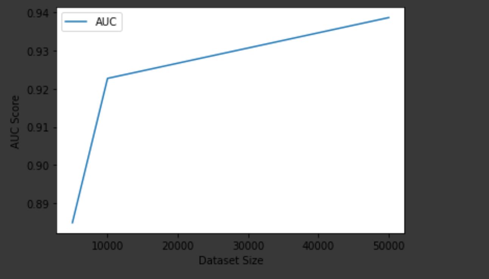

# Introduction

In this project, we wanted to examine various NLP techniques to analyze tweets about the 2020 election. The primary areas we explored were topic modeling and tweet classification by political party leaning, but we simultaneously looked into sub-problems within these. For example, we compared datasets of differing sizes to examine the impact of training set size on often noisy language data, like tweets, which often have words not common in a lot of training corpuses. We also examine the location distribution of Twitter users who support one party or another. 


# Data Collection

## Overview
Our team used political tweet datasets, election tweet datasets, and Tweet feeds for well known politicians for our tasks to gain insights from the areas we wanted to explore. Our very first version of the dataset were tweets from hand selected Democrats and Republicans on Twitter that we would mine from election datasets. However, as we went further in the project, we were introduced better APIs and archives that allowed us to get more structured data. As most of the Twitter contain the IDs and omit the other information for privacy purposes, we were required to use the Twitter API in conjunction with Hydrator to retrieve the full tweet.

## Dataset for 2020 Election Tweets
Our very first dataset was nearly 2000 tweets that we extracted from the IEEE 2020 political election dataset. We indexed each of our hand selected users' ids into the dataset to get tweets from the users. We then hydrated the tweets using Hydrator to create our final dataset.

## Dataset for 2020 Tweets from Congressional Entities
We relied on Twitter feed archives for committees, caucuses, parties, and members of Congress to form our 2020 political tweets dataset. We then were able to add a party label to the each of the tweets based on the political leaning of the respective committee, caucus, party, or member. This allowed us to find a labeled dataset of political Tweets from the year of 2020 of size 500,000, which allowed us to try more complex models to solve party classification from tweets. 

We got the archives of all political tweets from this link https://github.com/alexlitel/congresstweets/tree/master/data., which has all tweets by date in JSON format. We got the twitter information and party leaning of each of the political members from this link, https://alexlitel.github.io/congresstweets/, in JSON format. We then combined the two to create a dataset that has tweet labled by party. Our final combined dataset looked like this:
![]

## Random Sampling of Political Tweets from Users across the United States


## Topic Modeling of Election Tweets

### Overview

In addition to making election predictions based off of Twitter data, we also wanted to gauge which topics were driving the discourse of the election on Twitter. To do this, we used a topic modeling strategy on four separate datasets consisting of Democrat, Republican, Green Party, and Libertarian affiliated tweets. This allowed us to identify the people, policies, and ideas that motivated each respective party in the 2020 Presidential Election.

To extract topics from a set of tweets we used an automated keyword extraction technique with Natural Language Processing (NLP). These keywords were used as categories to narrow down the focus of a tweet. We began this process by preprocessing the text from all of the tweets in the dataset. Using the list of stopwords in the NLTK library as well as some of our own, we defined irrelevant text that could be ignored in the tweets. This included information such as account names, basic prepositions, and other filler words that did not have significance to the message of the tweet. Then, with all unnecessary words removed, we continued on to remove all punctuation, numerals, and other special characters such as emoticons. Our final preprocessing step was to normalize the text through stemming and lemmatization. These methods handle multiple representations of the same word, and convert each instance to a common root word. This way, when finding the most common topics discussed within the dataset, each word is properly represented.

At this point our data was ready to be processed. We used the bag of words model, which focuses on how often a word reoccurs in the text rather than the sequence words occur in. Using the Count Vectorizer library from sklearn, we tokenized the text from all of the tweets in our dataset. Then, using the returned vector, we calculated the frequency of bigrams, or sequences of two words, across the dataset. Choosing to use bigrams allowed us to find several distinct topics that were discussed regarding the election, whereas unigrams provided too little information and trigrams were unreliable given the already compact nature of tweets. These bigrams were then plotted in order of their frequency, allowing us to visualize the importance of certain topics and candidates to each individual party.

#### Democrats



Looking at the most common topics from Democrat affiliated accounts, we can clearly see the most important issues to the party for the 2020 election. With the COVID-19 pandemic far exceeding any other topic, even the candidates for the election, it is clear that the Democratic Party placed a greater emphasis on current pressing issues in America than their nominees. Additionally, we can see the Democratic Party’s urgency to encourage citizens to vote with topics such as “vote Biden”, “vote early”, and “vote mail” each appearing numerous times throughout the dataset. From this graph alone, it is clear that healthcare and the current state of the pandemic in the nation was one of the main driving forces of the party during this election cycle, evidenced by topics such as “covid 19”, “dr fauci”, and “care act”, which refers to the Affordable Care Act enacted by the Obama administration. The Democrats distrust for Republicans, and specifically Trump, is also shown in this graph, since “trump lied” is among the leading topics from the dataset. Therefore, through this visualization of the Democratic tweets leading up to the election we can clearly see a snapshot of the political discourse within the party.

## Republicans



After repeating the same process of keyword extraction with a Republican centric dataset, we can see a stark difference in the importance of topics between the Republican and Democratic parties leading up to the election. The Republicans were clearly much more candidate-oriented, with their focus being on Donald Trump himself rather than policies or current events in the nation. Many of the topics listed in the graph above are focused on specific individuals, whereas the Democratic graph, while still having an emphasis on Trump and Biden, also focused on other policy issues in the country. Similarly to the Democratic Party’s graph, we can also see the Republican Party’s distrust for their opponents. With some of the common topics being “hunter biden”, “sleepy joe”, and “biden email”, we can get a glimpse at the accusations made against Joe Biden and his family leading up to the election, and the importance each took on within the party. For example, the graph illustrates that Hunter Biden was a rather large focus for the Republican Party, as they sought to explain their suspicions regarding Joe Biden’s son to potential voters. Ultimately, the Republicans focused more on the individuals directly involved in the presidential race, as opposed to the Democrats, who focused more on current events.

#### Green Party



For the Green Party we reverted to focusing on unigrams, as the limited tweets available for this dataset was not conducive to a bigram setting. Through these unigrams we can see that the Green Party placed an emphasis on their own nominees, Howie Hawkins and Angela Walker, while focusing less on Biden and Trump. We can also get a sense of the beliefs of the Green Party, with policies such as defunding police and war as well as “gnd”, or the Green New Deal, being the party’s most prominent policy points.

#### Libertarian Party



Finally, we can see the most prominent subjects for the Libertarian Party heading into the election. As with the other parties, the Libertarians focused mostly on their nominees, Jo Jorgensen and Spike Cohen, trying to encourage American citizens to vote for them. We also see that the Libertarian Party focused more on criminal justice than their competitors, with topics such as “qualified immunity”, “criminal justice”, and “justice reform” being among the most prominent. From this alone we can see a clear departure from the focuses of other parties.

In conclusion, utilizing NLP to filter the content of tweets allowed us to extract common keywords that occurred throughout the dataset with a bag of words model. These keywords were then paired to create bigrams (in all cases except for the Green Party), which, when graphed by frequency, gave a strong insight into the priorities of each distinct party and the direction they desired the nation to follow. With these newfound understandings of the intentions of each party, we can also extract the desires of certain users or collective states overall by identifying which party they most align with according to their tweets. Therefore, we can not only point to their political affiliation in broad terms, but also pinpoint which policies and ideals they are likely to most align with.


## Topic Modeling of 2020 Politicians Tweets

Our team wanted to see what the most important topics that Congressional entitities tweet about per party and as a whole, and to see what phrases are used more. Combining topic modeling with sentiment analysis and other analysis tools, we can learn a lot about the current political atmosphere. From our topic modeling of 2020 politician tweets, we help machine learning models have context of a tweet to help classify what party a tweet leans towards.

### Topics Mined By LDA
We used TFIDF and LDA to generate the top 10 topics that politicians tweeted about in the year 2020 and we got the following. 

![]

As we can see from the image, there is a clear division in the topics. Furthermore, our topic model was able to catch that coronavirus  has had a strong impact on many topics, ranging from jobs, health care, school, businesses, as it is mentioned in those topics. 

### WordCloud (Top n-grams) For Republican Tweets, Hashtags, and Mentions

#### Republican Tweets

We can see here that Republicans are more likely to tweet about the protection program and mention small businesses. This is expected because these two topics are heavily on their agenda. 

#### Republican Hashtags
We see here that Covid19 is the biggest as well as PaycheckProtectionProgram. What is interesting is that Republicans have hashtags about veterans, oil companies, foreign polity, etc.
![]

#### Republican Mentions
We see here that Republicans mention realDonaldTrump disproportionately more than other posts. This is because members of the same party often retweet each others posts to commend their successes. Furthermore, as expected, we see that Republicans often mentioned other republicans in their tweets. 
![]

### WordCloud (Top n-grams) For Democratic Tweets, Hashtags, and Mentions

#### Democratic Tweets
We see that Democrats tweet about health care, public health, the trump administration, and small busineses the most. What is interesting is that Democrats on twitter say "Trump Administration", which carries somewhat of a negative connotation, much more often than Republicans. 
![]

#### Democratic Hashtags
Some interesting hashtags that the WordCloud caught onto ActOnClimate, FamiliesFirst, Juneteenth, ClimateChange, ClimateCrisis, ProtectOurCare, and more that are well known to fall under the liberal spectrum.
!{]

#### Democratic Mentions
We see that Democrats are more likely to retweet HouseDemocrats, as well as other democratic congressmen and congresswomen.
![]


# Classification With a Small Dataset
## Overview
This section covers our efforts to create a classification model for a small version of our dataset focusing on the 2020 election. We only had about 2000 labeled tweets, which is comparatively small for a language classification dataset, so we were curious whether BERT would be able to learn enough to produce classifiable embeddings.

## Getting Started With BERT

To start off with, we knew we wanted to embed the tweets we got using an existing language model. We could have chosen smaller, simpler models like word2vec, GloVe, or ELMo, but due to the easy availability of state-of-the-art Transformer-based models like BERT from [huggingface](https://huggingface.co/), we ended up choosing BERT.


Instantiating a BERT model from huggingface was extremely simple. All it took was installing the `transformers` package and a couple lines of code:

```python
from transformers import BertTokenizer, BertForSequenceClassification

tokenizer = BertTokenizer.from_pretrained('bert-base-uncased', 
                                           do_lower_case=True)
model = BertForSequenceClassification.from_pretrained('bert-base-uncased')
```

Essentially what this code does is provide us with a tokenizer and the BERT model itself. The tokenizer is necessary as the BERT model does not take raw text, but instead encoded tokens based on pre-trained word embeddings. Both the model and the tokenizer were instantiated from pre-trained weights provided by huggingface - `bert-base-uncased`, a smaller version of the model used in the BERT paper that still provides good results and is easier to train on less powerful hardware. In addition, since we used the `BertForSequenceClassification` class, we get a logistic regression layer added for free to aid in our classification task.

To use these, first we needed to clean our tweets, which we did using the `tweet-preprocessor` module plus some extra regex to remove punctuation and numbers. Then, we needed to tokenize and encode them, which we did like so:

```python
encoded_data_train = tokenizer.batch_encode_plus(
    dataset_clf[dataset_clf.data_type=='train'].clean_text.values, 
    add_special_tokens=True, 
    return_attention_mask=True, 
    padding=True,
    truncation=True, 
    return_tensors='pt'
)

input_ids_train = encoded_data_train['input_ids']
attention_masks_train = encoded_data_train['attention_mask']
labels_train = torch.tensor(dataset_clf[dataset_clf.data_type=='train'].label.values)

```

This code added in some important things. Namely, the `[SEP]` and `[PAD]` tokens that help BERT identify the end of a sentence, as well as the `[CLS]` token that signifies the start of the sentence and BERT embeds into a 768-dimensional space as an embedding for the entire sentence. Here is a great representation of this from [this article](http://jalammar.github.io/a-visual-guide-to-using-bert-for-the-first-time/):


 Great, we now had PyTorch tensors to train with. The next step was to fine-tune our model. We created a training loop in vanilla PyTorch, using the `AdamW` optimizer with learning rate of 1e-5 and epsilon of 1e-8. We also started off with a batch size of 8 and trained for 5 epochs.

 | | |
 |:--: | :--:| 
| *Metrics over 5 training epochs* | *Confusion matrix* |

We first tried a multi-class classification problem that involved Democrats, Republicans, Libertarians, and the Green Party, but ended up with almost 0% accuracy on the Libertarian and Green Party test samples (most likely due to the small number of data available and similarity of these tweets to the Republican and Democrat tweets), so we decided to focus on a binary classification problem between Republican and Democrat. This resulted in a final cross-entropy loss of 0.69, AUC of 0.80, and accuracy of 0.749. However, as you can see in the above graph, it appears that the testing loss is increasing past epoch 2, while the training loss is decreasing. This indicates overfitting, which we then tried to fix with hyperparameter tuning.


## Hyperparameter Tuning

Tuning deep learning models, we learned, was not as easy as tuning something like XGBoost or CatBoost, as there was no simple interface to `sklearn`'s `GridSearchCV` or similar utilities for PyTorch models. We tried [skorch](https://github.com/skorch-dev/skorch) and huggingface's `Trainer` class, which has built in tuning powered by [Ray Tune](https://docs.ray.io/en/latest/tune/index.html), but ran into problems with both. In the end, we ended up writing a custom script that used Ray Tune directly, along with [ASHA](https://arxiv.org/pdf/1810.05934.pdf) scheduling and the HyperOpt search algorithm, which implements tree-structured Parzen estimators to provide better suggestions for searching the configuration space. Also, we made sure to implement cross-validation with `sklearn`'s `StratifiedKFolds` to ensure we didn't pick our best parameters from a drop in loss by chance.

Here was the first search space we tried:

```python
config = {
    "lr": tune.loguniform(1e-6, 2e-5),
    "eps": tune.loguniform(1e-10, 1e-7),
    "weight_decay": tune.loguniform(1e-10, 1e-5),
    "batch_size": tune.choice([4, 8, 16, 32]),
    "epochs": tune.choice([2, 3, 4, 5])
}
```

Unfortunately, we were not able to find a model that performed significantly better using this space. We then tried just tuning over `lr`, `batch_size`, and `epochs`, as these were the only three parameters explicitly mentioned for fine-tuning in appendix A.3 of the [BERT Paper](https://arxiv.org/pdf/1810.04805.pdf). 

```python
config = {
    "lr": tune.choice([5e-5, 3e-5, 1e-5, 2e-5]),
    "batch_size": tune.choice([8, 16, 32]),
    "epochs": tune.choice([2, 3, 4])
}
```

We ran 8 experiments using this search space. Here is a graphical summary of the session:




We then identified trials 1 and 4 as promising, and evaluated both on the same 85/15 train-test split. Trial 1 achieved an accuracy of 0.752, AUC of 0.830, and testing loss of 0.549. On the other hand, Trial 2 did a little worse, with an accuracy of 0.732, AUC of 0.821, and test loss of 0.567. Due to this, we ended up going with the parameters from Trial 1, which are the following:

| **Batch size**    | **Epochs**        | **Learning rate** |
| :----: | :----: | :----:
| 16 | 2 | 2e-5 | 

## Final Thoughts

It appears that, even for small datasets, BERT is able to produce sentence embeddings that have a decent level of linear seperability, enough to be learned to a significant level by a simple logistic regression. This is promising, as researchers can easily evaluate recent political topics on Twitter that only have a small corpus of tweets with a fast-training model. In the next section, we explore the impact of a larger dataset on the performance of BERT to seperate broader political tweets.


# Classification with Big Dataset
## Overview
This section covers our efforts to create a classification model for a large version of our dataset focusing on the 2020 election. In this dataset, we had over 500,000 tweets, which is significantly larger than our small dataset, and we our goal was to find out whether BERT could learn an accurate way to produce classifiable embeddings.

## Procedure
To run BERT on the large dataset, we utilized the same techniques as we did for the small dataset. 

We preformed the same data cleaning techniques and initialized BERT in the same way. Likewise, as with the small dataset, we employed our custom script that used Ray Tune directly, along with [ASHA](https://arxiv.org/pdf/1810.05934.pdf) scheduling and the HyperOpt search algorithm. Similarly, we also made sure to implement cross-validation with `sklearn`'s `StratifiedKFolds` to ensure we didn't pick our best parameters from a drop in loss by chance.

We found that this large dataset was too big for Google CoLab's GPU to handle, as it would take an excessive amount of time, causing timeouts in our sessions, and even cause errors and failures while running. To combat these obstacles, we broke down our large dataset into smaller datasets of sizes 5k tweets, 10k tweets, and 50k tweets and analyzed those. In addition, we broke it down into smaller datasets to track the improvement of AUC as our dataset increased.

For each of these subsets, like before, we then tried just tuning over `lr`, `batch_size`, and `epochs`, as these were the only three parameters explicitly mentioned for fine-tuning in appendix A.3 of the [BERT Paper](https://arxiv.org/pdf/1810.04805.pdf). 

For reference, here's the configurations that we used to hyperparameterize our models.

```python
config = {
    "lr": tune.choice([5e-5, 3e-5, 1e-5, 2e-5]),
    "batch_size": tune.choice([8, 16, 32]),
    "epochs": tune.choice([2, 3, 4])
}
```

To find the best parameters, we ran 8 experiments for each of the three subsets. For each subset, 5k, 10k, and 50k tweets, we identified the models that had hyperparameters with the highest AUC values and evaluated them on the same 85/15 train-test split. We found the following parameters to be the most optimal for all three:

| **Batch size**    | **Epochs**        | **Learning rate** |
| :----: | :----: | :----:
| 8 | 3 | 2e-5 | 

With these hyperparameters, we found that the AUC to steadily increase as the dataset size increased. We found the optimal AUC on the test sets with these hyperparameters to be: 0.8849032763385403, 0.9227300126640381, 0.938660206530352 for the 5k, 10k, and 50k sets respectively. The graph below illustrates the increase in AUC score with respect to dataset size.




## Other Classifiers

We thought that in case the embeddings from BERT happened to not be linearly seperable, we could attempt to use non-linear models to classify the BERT embeddings. We first tried an MLP architecture defined by the following: 

```python
class MLPClassifier(torch.nn.Module):
  def __init__(self):
    super(MLPClassifier, self).__init__()
    self.hidden = torch.nn.Linear(bert.config.hidden_size, 128)
    self.output = torch.nn.Linear(128, bert.config.num_labels)

  def forward(self, x):
    x = self.hidden(x)
    x = F.relu(x)
    x = self.output(x)
    return x
```

However, this showed at best, worse to equal performance compared to our simple linear classifier. We also tried an XGBoost model trained and tuned over the output features from BERT of our training data. Unfortunately, this did significantly worse than both other approaches. Ultimately, in the interest of time, we selected our hyperparameter-tuned simple linear classifier stacked with BERT as our best model for political tweet classification on small datasets. Although, given more time, it would have been interesting to play around with the number of hidden layers and hidden layer sizes in our MLP architecture to see if we could produce a better model.
