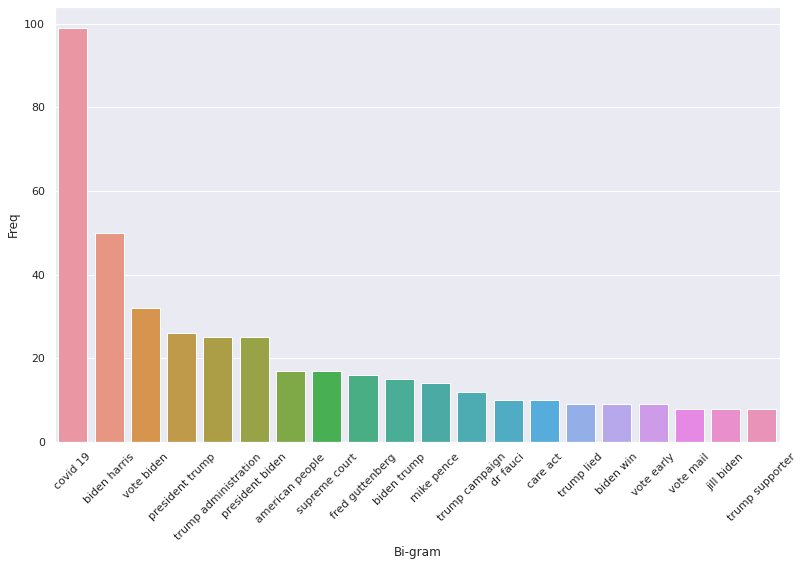
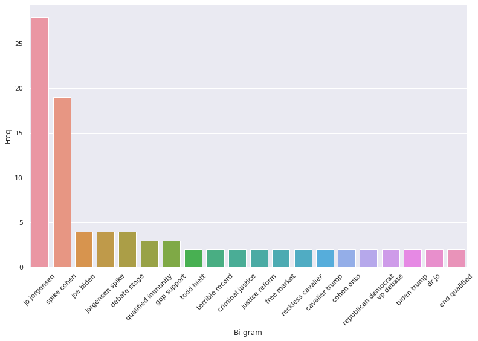

# Topic Modeling

## Overview

In addition to making election predictions based off of Twitter data, we also wanted to gauge which topics were driving the discourse of the election on Twitter. To do this, we used a topic modeling strategy on four separate datasets consisting of Democrat, Republican, Green Party, and Libertarian affiliated tweets. This allowed us to identify the people, policies, and ideas that motivated each respective party in the 2020 Presidential Election.

To extract topics from a set of tweets we used an automated keyword extraction technique with Natural Language Processing (NLP). These keywords were used as categories to narrow down the focus of a tweet. We began this process by preprocessing the text from all of the tweets in the dataset. Using the list of stopwords in the NLTK library as well as some of our own, we defined irrelevant text that could be ignored in the tweets. This included information such as account names, basic prepositions, and other filler words that did not have significance to the message of the tweet. Then, with all unnecessary words removed, we continued on to remove all punctuation, numerals, and other special characters such as emoticons. Our final preprocessing step was to normalize the text through stemming and lemmatization. These methods handle multiple representations of the same word, and convert each instance to a common root word. This way, when finding the most common topics discussed within the dataset, each word is properly represented.

At this point our data was ready to be processed. We used the bag of words model, which focuses on how often a word reoccurs in the text rather than the sequence words occur in. Using the Count Vectorizer library from sklearn, we tokenized the text from all of the tweets in our dataset. Then, using the returned vector, we calculated the frequency of bigrams, or sequences of two words, across the dataset. Choosing to use bigrams allowed us to find several distinct topics that were discussed regarding the election, whereas unigrams provided too little information and trigrams were unreliable given the already compact nature of tweets. These bigrams were then plotted in order of their frequency, allowing us to visualize the importance of certain topics and candidates to each individual party.

## Democrats

Looking at the most common topics from Democrat affiliated accounts, we can clearly see the most important issues to the party for the 2020 election. With the COVID-19 pandemic far exceeding any other topic, even the candidates for the election, it is clear that the Democratic Party placed a greater emphasis on current pressing issues in America than their nominees. Additionally, we can see the Democratic Party’s urgency to encourage citizens to vote with topics such as “vote Biden”, “vote early”, and “vote mail” each appearing numerous times throughout the dataset. From this graph alone, it is clear that healthcare and the current state of the pandemic in the nation was one of the main driving forces of the party during this election cycle, evidenced by topics such as “covid 19”, “dr fauci”, and “care act”, which refers to the Affordable Care Act enacted by the Obama administration. The Democrats distrust for Republicans, and specifically Trump, is also shown in this graph, since “trump lied” is among the leading topics from the dataset. Therefore, through this visualization of the Democratic tweets leading up to the election we can clearly see a snapshot of the political discourse within the party.

## Republicans

After repeating the same process of keyword extraction with a Republican centric dataset, we can see a stark difference in the importance of topics between the Republican and Democratic parties leading up to the election. The Republicans were clearly much more candidate-oriented, with their focus being on Donald Trump himself rather than policies or current events in the nation. Many of the topics listed in the graph above are focused on specific individuals, whereas the Democratic graph, while still having an emphasis on Trump and Biden, also focused on other policy issues in the country. Similarly to the Democratic Party’s graph, we can also see the Republican Party’s distrust for their opponents. With some of the common topics being “hunter biden”, “sleepy joe”, and “biden email”, we can get a glimpse at the accusations made against Joe Biden and his family leading up to the election, and the importance each took on within the party. For example, the graph illustrates that Hunter Biden was a rather large focus for the Republican Party, as they sought to explain their suspicions regarding Joe Biden’s son to potential voters. Ultimately, the Republicans focused more on the individuals directly involved in the presidential race, as opposed to the Democrats, who focused more on current events.

## Green Party

For the Green Party we reverted to focusing on unigrams, as the limited tweets available for this dataset was not conducive to a bigram setting. Through these unigrams we can see that the Green Party placed an emphasis on their own nominees, Howie Hawkins and Angela Walker, while focusing less on Biden and Trump. We can also get a sense of the beliefs of the Green Party, with policies such as defunding police and war as well as “gnd”, or the Green New Deal, being the party’s most prominent policy points.

## Libertarian Party

Finally, we can see the most prominent subjects for the Libertarian Party heading into the election. As with the other parties, the Libertarians focused mostly on their nominees, Jo Jorgensen and Spike Cohen, trying to encourage American citizens to vote for them. We also see that the Libertarian Party focused more on criminal justice than their competitors, with topics such as “qualified immunity”, “criminal justice”, and “justice reform” being among the most prominent. From this alone we can see a clear departure from the focuses of other parties.

In conclusion, utilizing NLP to filter the content of tweets allowed us to extract common keywords that occurred throughout the dataset with a bag of words model. These keywords were then paired to create bigrams (in all cases except for the Green Party), which, when graphed by frequency, gave a strong insight into the priorities of each distinct party and the direction they desired the nation to follow. With these newfound understandings of the intentions of each party, we can also extract the desires of certain users or collective states overall by identifying which party they most align with according to their tweets. Therefore, we can not only point to their political affiliation in broad terms, but also pinpoint which policies and ideals they are likely to most align with.
